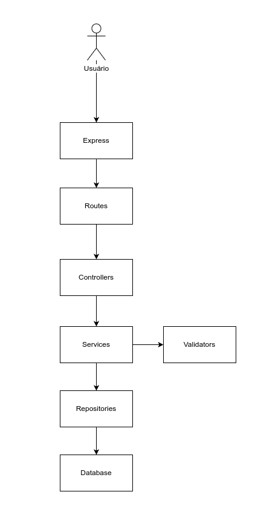
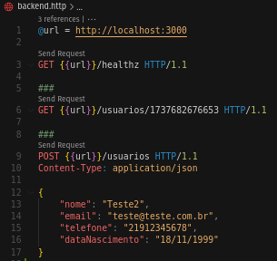
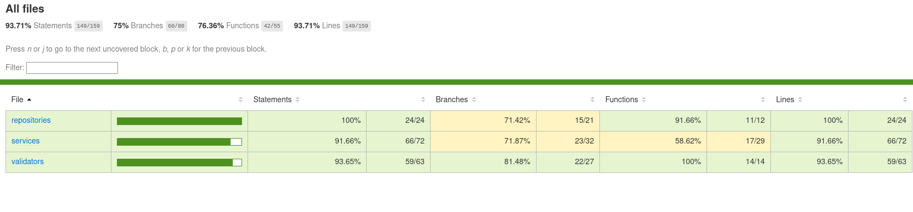
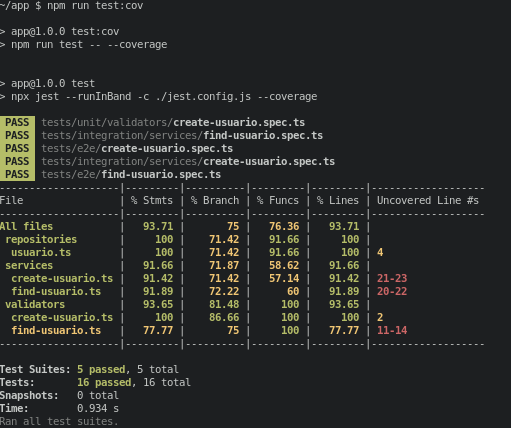
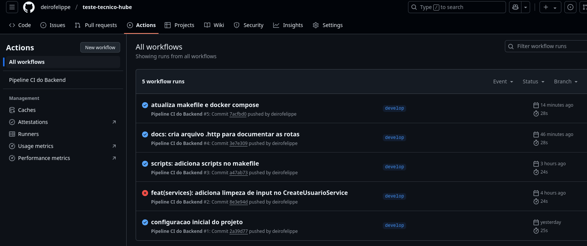

# Documentação

Teste técnico em que deve ser desenvolvido um backend com nodejs, typescript e express.

A API deve cadastrar usuario e buscar um usuário.

Deve ser seguido boa práticas, organização de código, padroes de projeto e arquitetura (Controller, Service, Repository)

## Sumário

- [Versões](#versões)
- [Destaques do que foi feito](#destaques-do-que-foi-feito)
- [Melhorias futuras](#melhorias-futuras)
- [Arquitetura usada](#arquitetura-usada)
- [Como instalar e executar?](#como-instalar-e-executar)
- [Como executar os testes e cobertura de teste?](#como-executar-os-testes-e-cobertura-de-teste)
- [GitHub Actions](#github-actions)

## Versões

|      Nome      |  Versão  |
| :------------: | :------: |
|     Nodejs     |  21.7.3  |
|      Jest      |  29.7.0  |
|    Express     |  4.21.2  |
|   Typescript   |  5.7.3   |
|     Docker     | 20.10.23 |
| Docker Compose |  2.15.1  |
|      SWC       |  1.10.9  |

## Destaques do que foi feito

- Nomes de variáveis e de funções descritivas.
- Early return para testar casos de falha primeiro e diminuir tamanho de ifs.
- Injeção de dependências para diminuir o acoplamento das classes a aumentar a testabilidade.
- Single Responsability Principle.
- Padrão de projeto Singleton.
- Prettier para padronizar a estilização do código.
- Testes de unidade, de integração e E2E.
- Docker e docker compose.
- Github actions para verificar a qualidade do código.
- Foi usada uma regra no GitHub que não pode ser feito o push direto na main, só é permitido merge na main por Pull Request e a pipeline deve passar.

## Melhorias futuras

- Fazer mais teste E2E, unitário e de integração.
- Padronizar melhor os nomes em portugues e inglês.
- Transformar a função sanitize em classe para cada rota.
- Usar lib para fazer validação.
- Usar eslint para analise estática de código e verificar a qualidade.
- Logs para informar: qual rota, qual metodo http (GET, POST), quando aconteceu, com quais dados, quais os eventos ocorreram ao longo da execução e os levels de cada log.

## Arquitetura usada

- **Express:** servidor recebe a requisição.
- **Routes:** executa o controller baseado no que a requisição pede, a rota. Local onde é instanciado as classes que o controller precisa para funcionar.
- **Controllers:** camada que recebe a requisição e responde. Ela que trata os dados para enviar para o service.
- **Services:** camada que executa a regra de negócio, orquestra o fluxo para os componentes serem executados.
- **Validators:** camada que validar dados de entrada.
- **Repositories:** camada que faz acesso a uma base de dados.
- **Database:** base de dados em memória de simulação.

## Como instalar e executar?

- `git clone https://github.com/deirofelippe/teste-tecnico-hube.git`
- `cd teste-tecnico-hube`
- Execute a aplicação com:
  - `make init-and-start`
  - **OU**
  - `docker compose up -d`
  - `docker container exec backend ash -c "npm ci && npm start"`
- Acessar pela url `http://localhost:3000/`.
- O arquivo `./backend.http` tem documentado as rotas.

## Como executar os testes e cobertura de teste?

- Executar os testes `docker container exec backend bash -c "npm run test tests/"` ou `make test`.
- Executar e gerar a cobertura de testes `docker container exec backend bash -c "npm run test:cov tests/"` ou `make test-cov`.
- O arquivo gerado será `./coverage/lcov-report/index.html`.

## GitHub Actions

- No aquiro [.github/workflows/ci.yaml](https://github.com/deirofelippe/teste-tecnico-hube/blob/main/.github/workflows/ci.yaml) foi configurado o uso do github action para testar, rodar build e verificar se tem vulnerabilidade no código com o `npm audit`.

